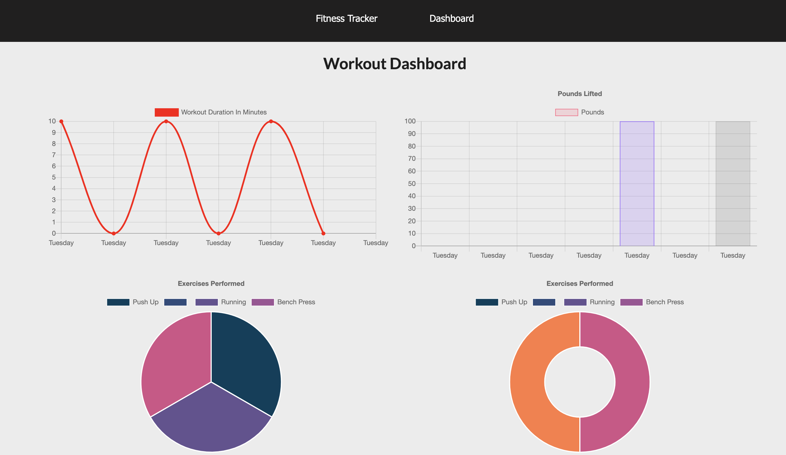

<h1 align="center"> Track the Burn </h1> 

  ## Description
  Track the Burn is a full-stack fitness tracker, that allows users to keep track of their daily workouts. Users are able to log multiple exercises for the day, keeping track of the type of exercise (cardio or resistance), name of exercise, weight, sets, reps, distance traveled and duration of exercises. Letting the user focus more on the workout and less about adding up the workouts they've completed. This application is deployed on heroku. To view it you can click the link below. 

 [Heroku Deployed App](https://tracktheburn.herokuapp.com/)

  ## Table of Contents

  * [Description](#Description)
  * [Installation](#Installation)
  * [Usage](#Usage)
  * [Contribute](#Contribute) 
  * [Tech Used](#tech-used)
  * [License](#License)
  * [Questions](#Questions)

  ## Usage
  

  - When you click on the deployed link above, you will be taken to the homepage. 
  - If you are a new user, then click new workout button to begin. 
  - Select the type of workout from the drop down menu. (resistance or cardio)
  - If you select resistance: enter exercise name, weight(lbs), sets, reps, duration of exercise. 
  - If you select cardio: enter name, distance, and duration. 
  - Already have some exersises logged for the day and want to add another exercise to the tracker, then just select continue workout.
  - View you daily dashboard by selecting dashboard on the navbar.

  

  🚀 Demos:
  --
   
   
  
   
   
  
   
   
  
   
   
  

  ## Tech Used

  - Express.js
  - MongoDB
  - Mongoose
  - Node.js
  - Heroku
  
  ## Questions

  Please visit my 
   [GitHub profile](https://github.com/dorley1993/) to check out this and other projects I've created and contributed to.

  ## License  

    Copyright © Danielle Orley 

    licensed under MIT